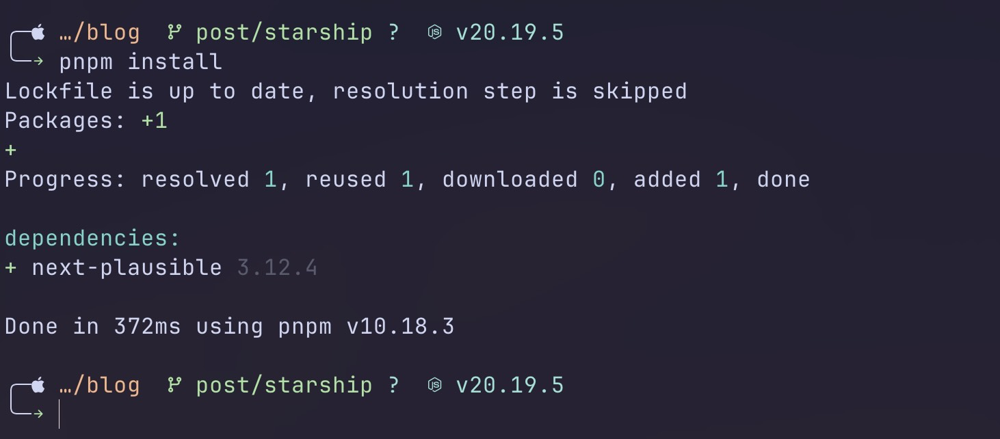

J’ai passé beaucoup de temps à bricoler mon terminal.  
Zsh, Fish, thèmes colorés, symboles étranges… à un moment, j’ai juste voulu un prompt **rapide**, **clair** et **esthétique**, sans dépendre d’un framework lourd.  
C’est comme ça que j’ai découvert **[Starship](https://starship.rs)**.

## Qu’est-ce que Starship ?

Starship, c’est un **prompt universel écrit en Rust**, compatible avec à peu près tous les shells (Bash, Zsh, Fish, etc.).  
Il affiche les informations utiles de ton environnement (branche Git, version Node.js, durée d’exécution, etc.) sans ralentir ton terminal.

L’idée est simple : tu gardes ton shell favori, mais tu lui offres un prompt moderne et hautement personnalisable, via un simple fichier TOML.

## Ma configuration Starship

### Structure générale

J’aime les prompts sur **plusieurs lignes**, pour mieux séparer les infos.  
Mon format ressemble à ça :

```toml
format = """
╭─\
$os\
$username\
$directory\
$git_branch\
$git_status\
$c\
$rust\
$golang\
$nodejs\
$php\
$java\
$kotlin\
$haskell\
$python\
$docker_context\
$cmd_duration\
$line_break\
╰─\
$character\
"""
```

La première ligne contient tout ce qui identifie le contexte : système, utilisateur, dossier, stack de langages, et statut Git.
La seconde ligne se termine par le caractère du prompt ($character), coloré selon le succès ou l’échec de la commande précédente.

```tsx
<button
  onClick={handleCopy}
  className="absolute right-2 top-2 p-2 rounded-md bg-muted/80 hover:bg-muted opacity-0 group-hover:opacity-100 transition-opacity z-10"
  aria-label={copied ? 'Code copié' : 'Copier le code'}
>
  {copied ? <IconCheck size={16} /> : <IconCopy size={16} />}
</button>
```

### Palette de couleurs personnalisée

J’utilise la palette **[Catppuccin Mocha](https://catppuccin.com/)** pour Starship, parce que je la trouve douce et cohérente avec le reste de mon environnement (VSCode, Ghostty, etc.).

```toml
palette = 'catppuccin_mocha'
```

Cette palette me permet d’avoir une cohérence chromatique entre mes outils.
Chaque module Starship peut référencer les couleurs définies dans la palette via `fg:` (text) et `bg:` (background).

### Les modules essentiels

#### `os`

Le module `os` affiche une icône selon le système :

```toml
[os]
disabled = false
style = "fg:text"
```

J’ai assigné une icône différente à pour certaines distributions Linux, mais aussi à macOS et Windows (au cas où):

```toml
[os.symbols]
Windows = "󰍲"
Ubuntu = "󰕈"
Raspbian = "󰐿"
Macos = ""
Linux = "󰌽"
Arch = "󰣇"
Debian = "󰣚"
EndeavourOS = "󰣇"
```

#### `directory`

J’ai limité la longueur du chemin avec une troncature :

```toml
[directory]
style = "fg:peach"
format = "[ $path ]($style)"
truncation_length = 3
truncation_symbol = "…/"
```

Trois niveaux de profondeur suffisent largement, et le résultat est bien plus lisible.

#### `git_branch` et `git_status`

Ces deux modules sont probablement ceux que je regarde le plus.
`git_branch` affiche l’icône du repo et le nom de la branche :

```toml
[git_branch]
symbol = ""
style = "fg:teal"
format = '[[ $symbol $branch ](fg:green)]($style)'
```

`git_status` montre l’état du dépôt de manière concise :

```toml
[git_status]
format = '[$all_status]($style)'
style = "fg:teal"
ahead = "⇡${count} "
behind     = "⇣${count} "
modified = " "
untracked = "? "
up_to_date = " "
```

#### `cmd_duration`

Je trouve ce module sous-estimé : il montre combien de temps une commande a pris, même à la milliseconde près.

```toml
[cmd_duration]
show_milliseconds = true
format = "[ took [$duration ](bold fg:lavender)](fg:lavender)"
```

Très pratique pour voir combien de temps prend un `docker build`.

#### `character`

Le symbole final du prompt varie selon l’état :

```toml
[character]
success_symbol = '[](bold fg:green)'
error_symbol = '[](bold fg:red)'
```

C’est tout bête, mais ce petit détail donne beaucoup de personnalité au terminal.

## Détails esthétiques

Starship supporte les **Nerd Fonts**, ce qui permet d’utiliser des icônes propres à chaque module (``, `󰎙`, ``, etc.).
Vous pouvez aller sur [https://www.nerdfonts.com/](https://www.nerdfonts.com/) pour trouver les polices et des icones.

Les styles (`fg:teal`, `fg:lavender`, etc.) restent cohérents sur l’ensemble du prompt.

J’ai aussi choisi de garder un prompt compact, sans temps ni hostname, pour rester concentré sur l’essentiel.

## Exemple de rendu

Voici un aperçu du résultat :



Le prompt affiche :

- le nom du dossier et la branche Git,
- la version de Node.js,
- et le symbole `` vert pour indiquer que tout va bien.

Quand un dépôt a des changements, les symboles du module `git_status` s’activent automatiquement.

## Pourquoi j’aime cette config

Ce que j’apprécie le plus avec Starship, c’est sa **rapidité**.
Écrit en Rust, il est quasi instantané, même avec plusieurs modules activés.
Et comme tout est dans un simple fichier `~/.config/starship.toml`, c’est facile à versionner et à reproduire sur une autre machine.

C’est un petit outil, mais il change vraiment la façon dont je perçois mon terminal.
Il donne envie d’y passer du temps, et c’est déjà pas mal.

Et voici le lien vers ma configutation complète: [github dotfiles/starship](https://github.com/cl3tus-sh/dotfiles/blob/master/globals/starship/.config/starship.toml)
